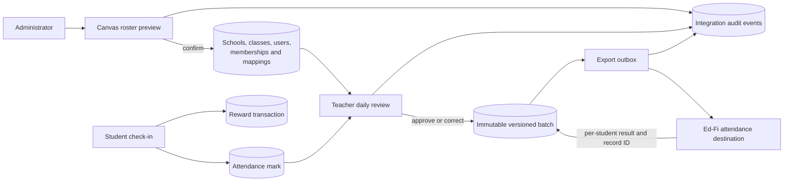

# Integration Architecture and Operations

Attendance Quest integrates with external systems only to avoid duplicate
roster setup and to deliver teacher-approved attendance. It remains an
elementary attendance-and-rewards application: students do not connect provider
accounts, open embedded LMS pages, or view assignments, grades, submissions, or
course content.

## Architecture

The provider-neutral contracts live in `internal/integrations`:

- `ProviderRegistry` registers adapters under a stable provider kind and rejects
  duplicates.
- `ProviderMetadata` describes authentication and capabilities.
- `RosterSource` validates a connection and reads normalized schools, classes,
  people, and memberships through opaque pagination.
- `AttendanceDestination` validates a connection and attendance-code mapping,
  then upserts a versioned batch with a result for each student.
- `DestinationMappingValidator` optionally validates the provider-specific
  school, class, and student identifiers entered by an administrator.

Provider-specific responses stay inside their adapter. The Canvas adapter in
`internal/integrations/canvas` implements the roster-source side. The Ed-Fi
adapter in `internal/integrations/edfi` implements the attendance-destination
side. These may be different systems for the same school.



`ClassroomMemberships` is the normalized class roster. Compatibility writes
also maintain `Users.ClassroomID`, `Classrooms.TeacherID`, and
`ClassroomStudents` while older application flows still need them.
`AttendanceMarks` normalizes student check-ins, while `AttendanceBatches` and
their entries retain immutable teacher-approved snapshots. Provider
connections, mappings, delivery attempts, and audit events are durable
PostgreSQL records.

Apply `Seed_DataBase3.sql` before deploying code that uses these integration
stores. The application never runs that migration automatically. It is
idempotent and additive: existing users, classrooms, attendance history,
rewards, and local-only classes remain intact.

## Credential encryption

Set `INTEGRATION_CREDENTIAL_KEY` to a base64-encoded 32-byte AES-256 key. One
PowerShell way to generate a key is:

```powershell
$bytes = New-Object byte[] 32
[Security.Cryptography.RandomNumberGenerator]::Fill($bytes)
[Convert]::ToBase64String($bytes)
```

Keep the value in the deployment secret manager, not in source control.
Provider credential JSON is encrypted with AES-GCM and a fresh random nonce on
every write. Ciphertext, nonce, and encryption format version are stored
separately from non-secret provider configuration.

If the key is missing or invalid, the core application still starts, but
integration credential reads and writes fail with a configuration error.
Existing ciphertext is never overwritten when it cannot be decrypted. Do not
replace a key after credentials have been stored unless those rows are first
re-encrypted through a planned rotation process.

Canvas OAuth also requires:

```text
CANVAS_CLIENT_ID=<Canvas developer key client ID>
CANVAS_CLIENT_SECRET=<Canvas developer key secret>
CANVAS_REDIRECT_URL=https://attendance.example/admin/integrations/canvas/callback
```

The redirect URL must exactly match the callback configured in Canvas.

## Canvas roster setup

1. Apply `Seed_DataBase3.sql`, configure the encryption key, and configure the
   Canvas OAuth variables.
2. In **Admin → Canvas Import**, enter the school Canvas URL, account ID, and a
   local connection name.
3. Authorize an administrator whose Canvas account can read the intended
   courses and enrollments.
4. Select courses and generate a preview.
5. Review every suggested match, then confirm the import.
6. Use **Preview sync** later to run another manual synchronization.

Canvas imports schools, classes, teachers, students, and memberships only.
Canvas passwords are never requested or imported. New people receive pending
Attendance Quest accounts so local invitations and credentials remain under
local control.

Existing external mappings are reused first, followed by exact SIS IDs. Email
or local student-ID candidates are suggestions that require administrator
confirmation. Names are never used to match accounts. A later confirmed sync
archives imported memberships that disappeared from the selected Canvas
courses; it does not delete users, attendance, rewards, or local-only
memberships.

## Teacher approval and corrections

Student check-in remains an Attendance Quest action and awards its reward in the
same local transaction. It is only a pending attendance indication; rewards do
not change when a teacher later changes the official status.

In the teacher attendance page, choose an assigned class and school date.
Checked-in students default to present and students without a check-in default
to absent. Review the whole roster, change either status as needed, and approve
the entire class. Administrators may review any class, while teachers are
limited to active teacher memberships.

Each approval creates a complete immutable snapshot. The first version is
locally approved or pending export when an active destination exists. Approving
the date again creates a correction version. The visible lifecycle is:

```text
Awaiting approval → Approved locally → Pending export → Officially recorded
                                      ↘ Export failed
Officially recorded → Correction pending → Officially recorded
```

## Attendance destination setup

The installed official-record adapter is **Ed-Fi ODS/API**. It uses OAuth 2.0
client credentials and Ed-Fi's exception-only daily attendance model: absence
creates or updates a `StudentSchoolAttendanceEvent`, while a correction to
present deletes the accepted absence by its stored Ed-Fi resource ID.

In **Admin → Attendance Exports**, choose Ed-Fi and enter non-secret provider
configuration:

```json
{
  "base_url": "https://your-edfi-host.example/api",
  "data_path": "/data/v3/ed-fi",
  "session_name": "2026-2027 School Year",
  "school_year": 2027
}
```

Enter the issued credentials separately:

```json
{
  "client_key": "replace-me",
  "client_secret": "replace-me"
}
```

Use `exception-only` as the present mapping. The absent mapping must be the
installation's complete `AttendanceEventCategoryDescriptor` URI, such as:

```text
uri://ed-fi.org/AttendanceEventCategoryDescriptor#Unexcused Absence
```

After validation, open **Identifiers** and complete unresolved mappings:

- school → positive Ed-Fi `schoolId`
- class → the Ed-Fi section identifier expected by this installation
- student → Ed-Fi `studentUniqueId`

Attendance Quest seeds these from stored SIS IDs when possible. The destination
cannot become active until its connection, codes, and required identifiers
validate. It also cannot be enabled unless its adapter declares safe upsert or
correction behavior.

## Failure and retry behavior

Approved batches form a durable outbox. The worker checks at most 20 due batches
every 15 seconds. Rate limits, temporary provider failures, and timeouts retry
automatically up to five attempts, using exponential delays starting at 30
seconds and capped at 30 minutes. A recently started attempt is held for five
minutes so concurrent workers do not immediately reclaim it.

The idempotency identity includes destination, external school, external class,
school date, external student, and batch version. Every delivery attempt and
per-student acceptance or rejection is retained. Accepted destination record
IDs are stored for safe corrections.

Authentication and permission failures mark destination health as an error.
Mapping errors, permanent provider rejections, missing per-student responses,
and exhausted temporary failures remain `export_failed` and are never shown as
officially recorded. Inspect these under **Admin → Attendance Exports**, correct
the connection or mappings, and use **Retry**. Manual retries are still durable
attempts and do not erase the earlier failure.

## Logs and audit trail

Operational logs cover provider registration, unavailable encryption,
connection persistence, Canvas authorization and import outcomes, attendance
approvals and corrections, export attempts and outcomes, retries, destination
health changes, and failures. They use connection, class, batch, actor, attempt,
and aggregate-count fields; they do not log credential JSON, OAuth tokens,
client secrets, roster payloads, or per-student export payloads.

`IntegrationAuditEvents` is the durable administrative trail. It records
connection changes, roster imports, approvals, corrections, destination
changes, mapping completion, attempt starts, delivery outcomes, and manual retry
requests. Delivery audit metadata may retain the local/external record
identifiers and status needed to investigate a student-level rejection, but it
does not contain names, email addresses, tokens, or credential JSON.

## Adding another adapter

1. Choose a stable lowercase provider kind and create a package under
   `internal/integrations/<kind>`.
2. Implement `Provider` plus `RosterSource`, `AttendanceDestination`, or both.
   Return only the normalized types from `internal/integrations`.
3. Advertise only capabilities the adapter actually provides. An attendance
   destination must support safe upsert or corrections before it can be active.
4. Validate URLs, credentials, permissions, code mappings, and any
   provider-specific identifiers. Wrap failures with the shared integration
   error categories so retry and health behavior remain consistent.
5. Keep secrets in `Connection.Credentials` and non-secret values in
   `Connection.Configuration`. Never persist or log decrypted credentials.
6. Register the adapter once in `cmd/webserver/main.go`. Duplicate kinds are a
   startup log error.
7. Add the smallest admin-only configuration flow required by the provider.
   Do not add student provider linking or LMS content features.
8. Verify pagination, matching, idempotency, corrections, partial delivery
   results, retry classification, and credential redaction with automated tests.

Adding a roster adapter does not require changing attendance delivery, and
adding a destination does not require changing roster import. That separation
is the reason Attendance Quest can support elementary schools that use systems
other than Canvas.
